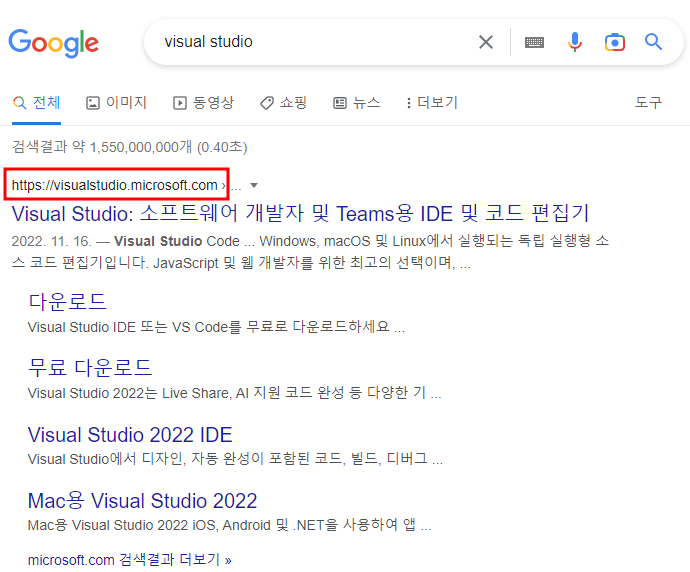
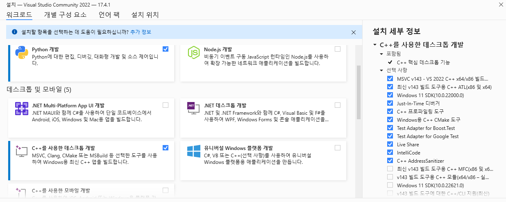

---
layout: single
title:  "Python 인공지능 개발환경 설정"
categories: setting
tag: [python, AI, visual studio, miniconda, vscode, cuda, cudnn, cmake, pytorch]
toc: true
author_profile: false
sidebar:
    nav: "docs"
---

**[주의: Local CUDA 환경이므로 단순 Python 개발을 원하시는 분은 miniconda, vscode 두개만 설치하도록 하자]**
{: .notice--danger}

# Visual Studio 2022 Community

## VS 다운로드

google에서 visual studio를 검색하여

공식홈페이지([[https://visualstudio.microsoft.com/ko/])로](https://visualstudio.microsoft.com/ko/)%EB%A1%9C) 접속하여 다운로드

## VS 설치

설치옵션 = python 개발 / C++ 데스트톱 개발

(CUDA 설치 시 머신러닝에 필요한 모듈 설치됨, 추후 필요하다면 업데이트)

# Miniconda

가상환경 버전관리 형상관리의 Anaconda 축소형 IDE(통합개발환경)

## Miniconda 다운

## Miniconda 설치

# CUDA

## CUDA 다운

## CUDA 설치

# CUDNN

## CUDNN 다운

## CUDNN 설치

# CMAKE

## CMAKE 다운

## CMAKE 설치

# Visual Studio Code

## VSCODE 다운

## VSCODE 설치

# Pytorch

## Pytorch 설치