---
layout: single
title:  "Python 인공지능 개발환경 설정"
categories: setting
tag: [python, AI, visual studio, miniconda, vscode, cuda, cudnn, cmake, pytorch]
toc: true
author_profile: false
sidebar:
    nav: "docs"
---

**[주의: 인공지능 개발을 위한 Local CUDA 환경설정입니다]**
{: .notice--danger}

<h2> python 설치 2단계 </h2>
<ul>
    <li>단순 python 개발환</li>
    <li>Local CUDA를 이용한 인공지능 개발환경</li>
</ul>

# Miniconda

Python을 설치해도 좋다 하지만 가상환경을 제대로 활용하고 싶다면

Anaconda가 좋다.

그러나 너무 무겁다.. 그래서 가벼운 Miniconda로 환경설정을 한다.

## Miniconda 다운 및 설치

[공식홈페이지 접속](https://docs.conda.io/en/latest/miniconda.html#windows-installers){: .btn .btn--warning}

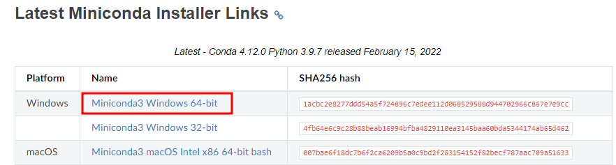2d5a94e6e44aa521a1a2d.png)

저는 windows11 64bit를 사용하기에 64비트용 최신버전을 다운받아 설치

설치경로는 `C:/Miniconda3`

# Visual Studio Code

배울때마다 환경설정을 하나씩 설명할테지만 저는 python, c/c++, java, jsp, spring 모두 vscode에서 사용할 예정입니다. 그래서 다른 IDE는 쳐다도 보지않습니다.

## VSCODE 다운 및 설치

[공식홈페이지 접속](https://code.visualstudio.com/download){: .btn .btn--warning} 

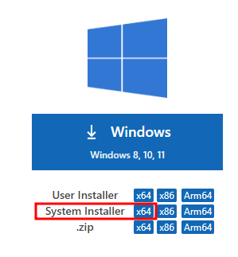

마찬가지로 64비트 system installer를 다운받아 설치한다

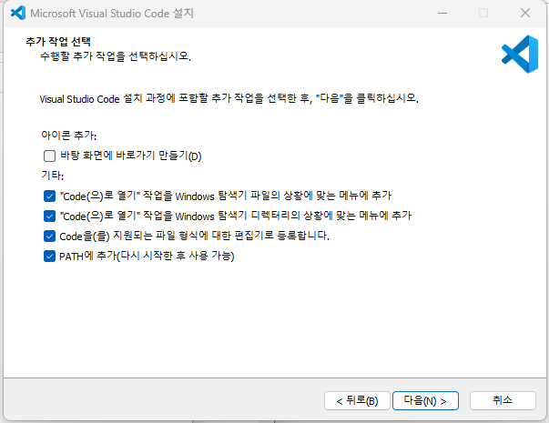

vscode를 workspace에서 바로 여는것은 매우 편리하다 그래서 체크를 하고 설치를 하자

## 설치가 완료되었으면 환경설정을 해보자

File > Preferences > Settings

User > Extensions > Python

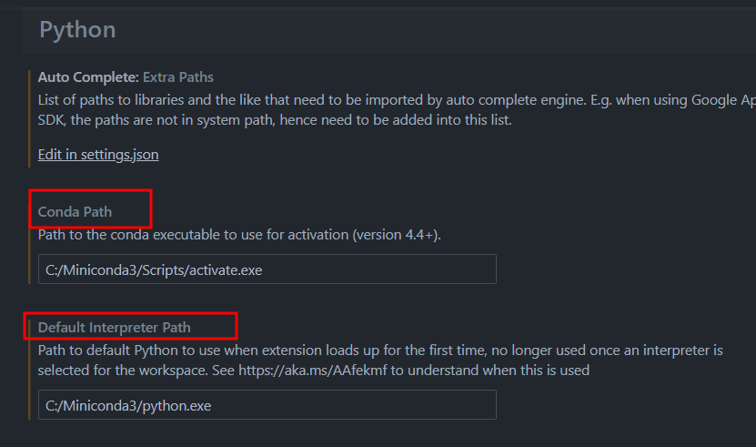

Conda Path `C:/Miniconda3/Scripts/activate.exe`

Default interpreter Path `C:/Miniconda3/python.exe`

**[여기까지 진행하면 python 개발 환경설정은 끝이다
이후 아래에서는 GPU를 이용한 인공지능 개발환경 설정이다.]**

{: .notice--danger}

# Visual Studio 2022 Community

## VS 다운로드 및 설치

[공식홈페이지 접속](https://visualstudio.microsoft.com/ko/){: .btn .btn--warning}

community 2022 버전으로 모든 개발이 가능하다. 개인이라면 굳이 유료버전인 professional과 enterprise를 사용하지 않아도 된다.

설치옵션 = python 개발 / C++ 데스크톱 개발

(C++ 설치를 왜해요? 일단 설치해야한다.. 없으면 아무것도 진행이안된다..)

# CMAKE

## CMAKE 다운 및 설치

[공식홈페이지 접속](https://cmake.org/download/){: .btn .btn--warning}

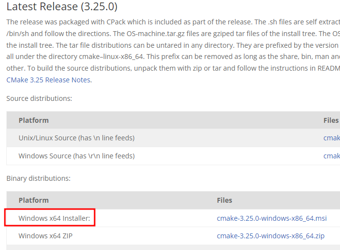

`.msi`가 좋다` .zip`은 압축풀고 > 폴더이동하고 > 환경변수 경로 추가해주고...

아무튼 msi파일을 써라!!

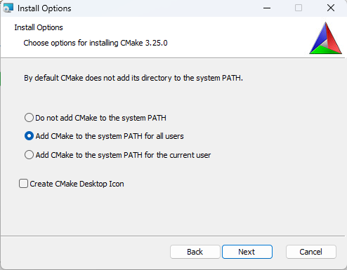

역시 경로추가 옵션이 있다 msi파일 만세!!

# CUDA

## CUDA 다운 및 설치

[공식홈페이지 접속](https://developer.nvidia.com/cuda-toolkit-archive){: .btn .btn--warning}

로그인이 필요할수도 있다. CuDNN도 설치해야 하므로 미리 NVIDIA 계정을 만들어 놓자

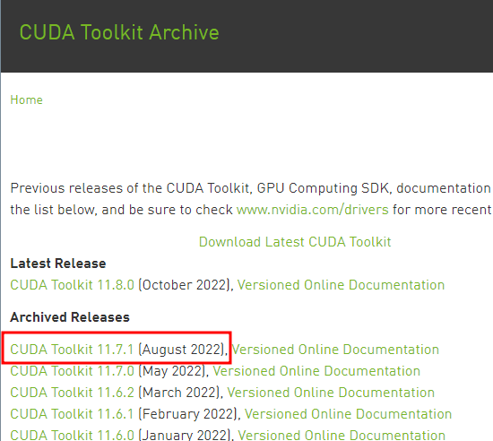

CUDA 11.8 버전을 설치하지 왜 11.7 버전을 설치하냐?

Pytorch가 아직 11.7버전까지밖에 지원하지 않는다...

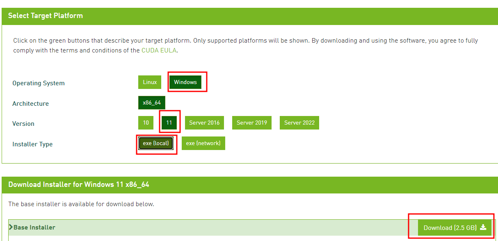 

OS는 Windows Version은 11 (윈도우 11을 사용한다) local환경까지 선택하고 다운받아 설치한다.

# CUDNN

## CUDNN 다운 및 설치

구글에 cudnn 검색해서 공식홈페이지로 간다

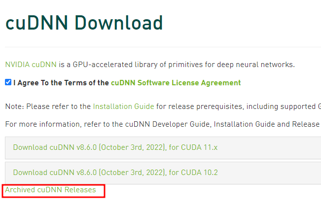

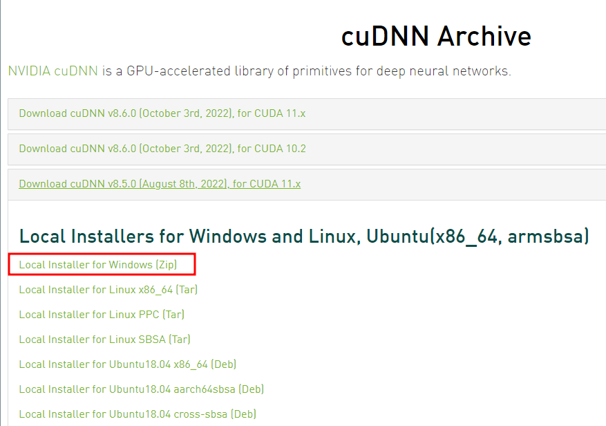

버전은 cuda 11.7에 맞게

응?? 그럼 날짜에 맞게 8.5.0 버전을 설치한다

(참고 본인의 그래픽카드가 뭔지 아는것도 중요하다. 설치가능 버전이 따로 있다.)

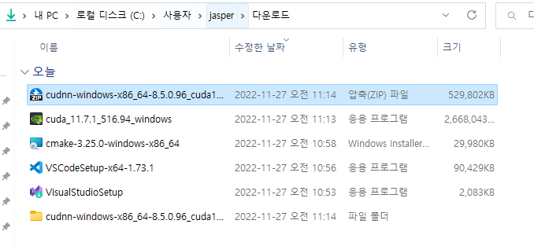

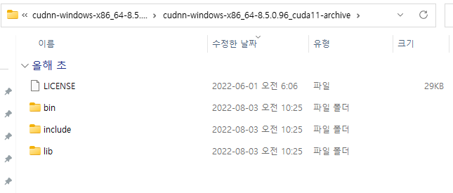

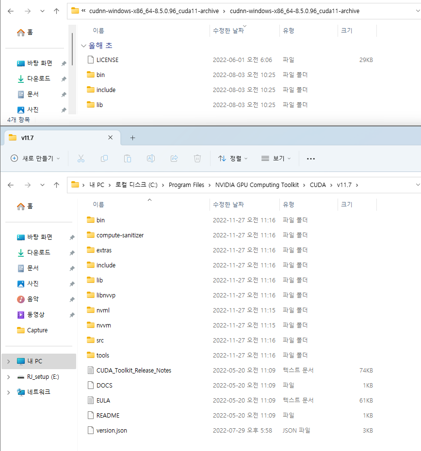

CUDNN은 다운받은 파일 압축을 풀어서

폴더의 모든 파일들을 CUDA 폴더에 파일을 덮어쓰기 하면된다

사실 드디어 준비가 끝나다

인공지능(딥러닝) 플랫폼 중 가장 강력한 pytorch를 설치해보자

# Pytorch

## Pytorch 다운 및 설치

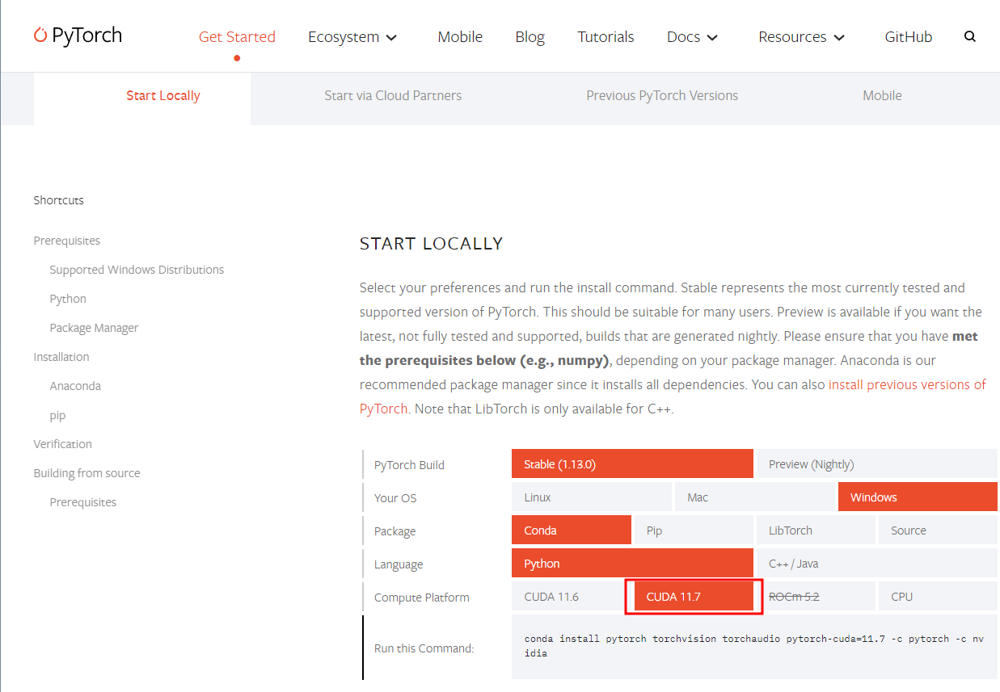

저와 같이 환경세팅을 하신분이라면

홈페이지 들어가지말고 아래 코드를 terminal에 치면된다

`conda install pytorch torchvision torchaudio pytorch-cuda=11.7 -c pytorch -c nvidia`

(주의점: conda환경은 terminal을 관리자로 실행해야만 모듈 및 라이브러리가 설치된다)

# 자 이제 빠르게 코드만 공유하고 끝내보자

터미널(윈도우, anaconda prompt, powershell, cmd 모두 가능) 관리자 권한 실행

`conda --version`

`conda install conda=22.9.0`

`conda search python`

`conda install python=3.10.8`

`python -m pip install --upgrade pip`

`conda update --all`

여기까지가 conda 및 python 최신버전 업데이트

`conda create --prefix D:/envs/mmcv`

`conda config --prepend envs_dirs D:/envs`

`conda activate D:/envs/mmcv`

`conda init`

여기서 터미널을 끄고 새로 켜야 됩니다

`conda activate mmcv`

여기까지 잘 되면 가상환경이 잘 잡힌겁니다

[아 까먹은거 하나 mingw64 다운받아 설치하자]

{: .notice--danger}

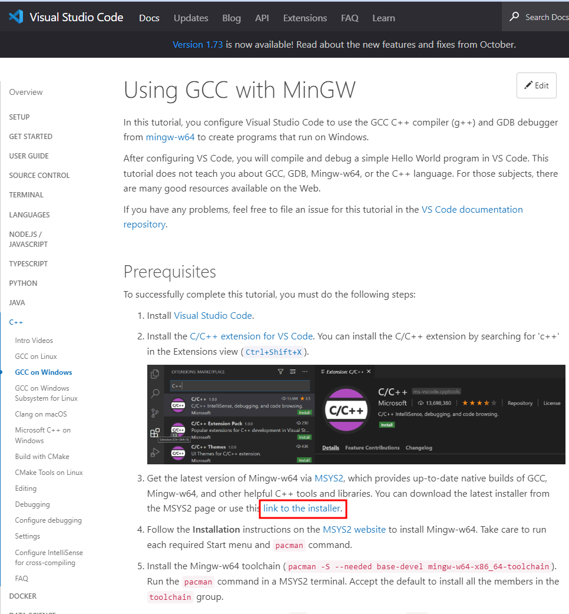

이거는 한번 설치해보시고 모르겠으면 댓글 물어보세요...